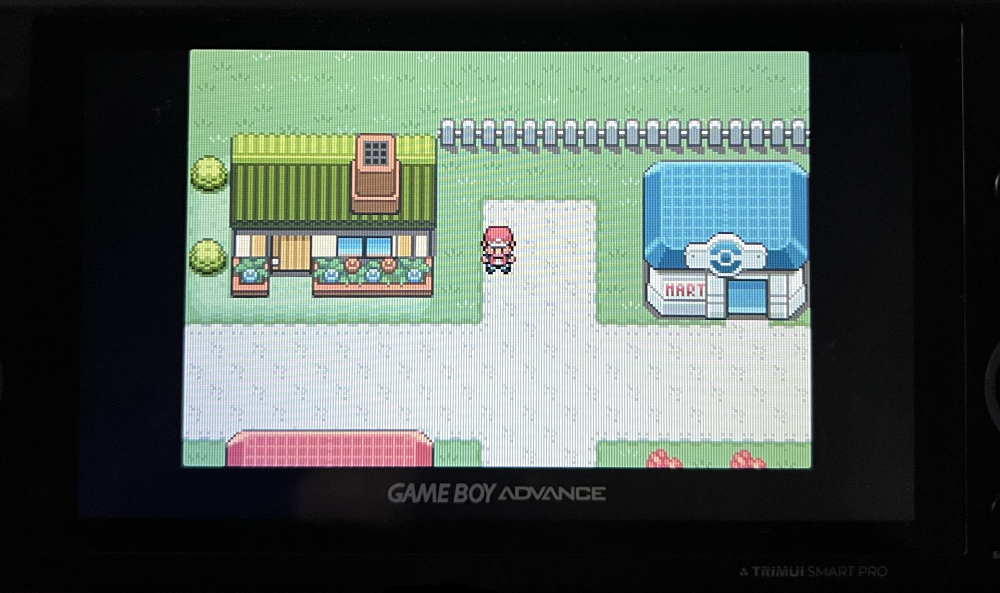

# RetroArch Overlays

720p overlay for the TrimUI Smart Pro. Only GBA for now.

## Using

1. `Quick Menu -> On-Screen Overlay`: Set `Overlay Preset` to a `.cfg` file in this repository
2. `Settings -> Video -> Scaling`:
	1. Enable `Integer Scale` (Balanced pixels, ensures screen is correctly sized for the overlay)
	2. Set `Viewport Anchor Bias Y` to `0.00` (Positions the screen to the top)

## TODO

- Grid effect
- Other systems
